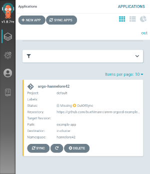
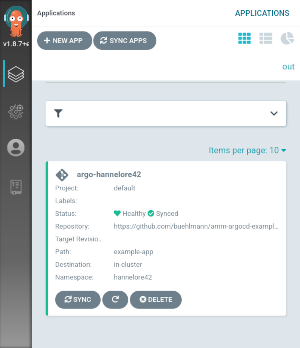
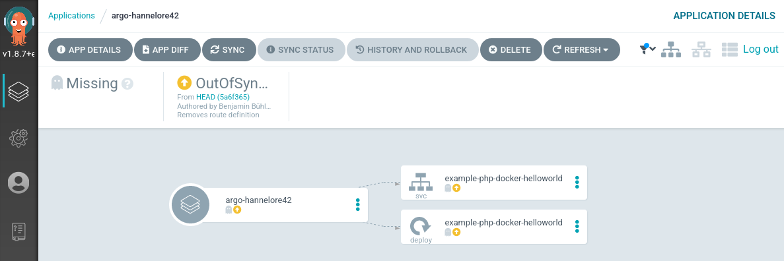
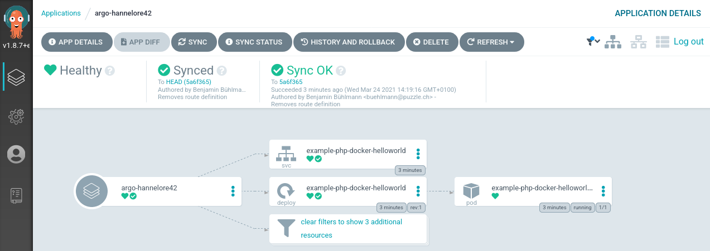
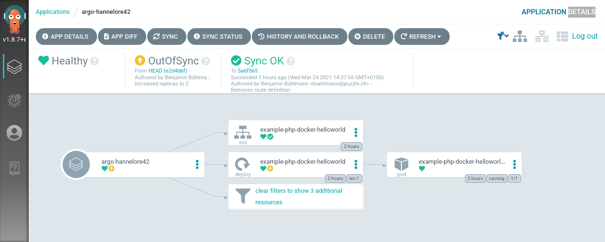
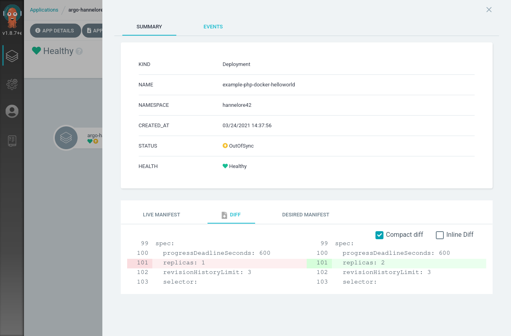

In this lab you will learn how to deploy a simple application using Argo CD.

Our lab setup consists of the following components:

* Git Server: [https://{}](https://{}/)
* Argo CD Server: [https://{}](https://{})
* {}Kubernetes Cluster{}{}OpenShift Cluster{}


## {} {}Login to the Gitea and Clone the Repo{}{}Fork the Git repository{}

For this training we're using a Git Server deployed under [https://{}](https://{}/).

Open your webbrowser and navigate to [https://{}](https://{}/).
Login with your credentials and have a look at the forked repository containing your `<username>`.

As we are proceeding according to the GitOps principle we need some example resource manifests in a Git repository which we can edit. The **URL** of the Git repository we'll be working with will look like `https://{}/argocd-training-examples-<username>.git`.

Within your IDE, set the `USER` environment variable to your personal `<username>`.
```bash
export USER=<user>
```

Verify that with the following command:
```bash
echo $USER
```

The `USER` variable will be used as part of the commands to make the lab experience more comfortable for you.


Clone the forked repository to your local workspace:

```bash
git clone https://$USER@{}/argocd-training-examples-$USER.git
```

Change the working directory to the cloned git repository:

```bash
cd argocd-training-examples-$USER/
```


## {} Deploying the resources with Argo CD

Now we want to deploy the resource manifests contained in the cloned repository with Argo CD to demonstrate the basic features of Argo CD.

{}
Create a file `example-application.yaml` with the following content:

```yaml
apiVersion: argoproj.io/v1alpha1
kind: Application
metadata:
  name: example-application-$USER
  namespace: {}
spec:
  project: default
  source:
    repoURL: https://{}/argocd-training-examples-$USER.git
    targetRevision: HEAD
    path: example-app
  destination:
    server: https://kubernetes.default.svc
    namespace: $USER
```

Apply it to the cluster:

```bash
{} apply -f application.yaml
```

Expected output: `application 'example-application-<username>' created`

{}We don't need to provide Git credentials because these are already configured for the entire GitLab group. {}

Argo CD will now detect the application. Once the application is created, you can view its status:

```bash
{} describe application example-application-$USER -n {}
```

Open the [Argo CD UI](https://{}) and click **Sync** to deploy the resources. This command retrieves the manifests from the git repository and performs a {} apply on them. From now on, all resources are managed by Argo CD. Congrats, the first step in direction GitOps! :)

Once synced the application status will show as **Healthy**.

```bash
{} get application example-application-$USER -n {}
```
{}

Application overview in unsynced and synced state




Detailed view of a application in unsynced and synced state






## {} Automated Sync Policy and Diff

When there is a new commit in your Git repository, the Argo CD application becomes OutOfSync. Let's assume we want to scale up our `Deployment` of the example application from 1 to 2 replicas. We will change this in the Deployment manifest.

Increase the number of replicas in your file `<workspace>/example-app/deployment.yaml` to 2.

```

apiVersion: apps/v1
kind: Deployment
metadata:
  name: simple-example
spec:
  replicas: 2
  revisionHistoryLimit: 3
  selector:
    matchLabels:
      app: simple-example
  template:
    metadata:
      labels:
        app: simple-example
    spec:
      containers:
      - image: quay.io/acend/example-web-go
        name: simple-example
        ports:
        - containerPort: 5000

```


Commit the changes and push them to your personal remote Git repository.

```bash
git add .
git commit -m "Increased replicas to 2"
git push
```

After a successful push you should see the following output

```bash
Enumerating objects: 7, done.
Counting objects: 100% (7/7), done.
Delta compression using up to 8 threads
Compressing objects: 100% (4/4), done.
Writing objects: 100% (4/4), 367 bytes | 367.00 KiB/s, done.
Total 4 (delta 3), reused 0 (delta 0), pack-reused 0
remote: Resolving deltas: 100% (3/3), completed with 3 local objects.
To https://{}/<username>/argocd-training-examples.git
   5a6f365..e2d4bbf  master -> master
```

Out of the box Git will be polled by Argo CD in a predefined interval (defaults to 3 minutes). To use a synchronous workflow you can use webhooks in Git. These will trigger a synchronization in Argo CD on every push to the repository.


Now open the web console of Argo CD and go to your application. The deployment `simple-example` is marked as 'OutOfSync':



When an application is OutOfSync then your deployed 'live state' is no longer the same as the 'target state' which is represented by the resource manifests in the Git repository. You can inspect the differences between live and target state with a click on Deployment > Diff:



Click **Refresh** on the `example-app-$USER` application to trigger an immediate update. The application will be scaled up to 2 replicas and the resources are in Sync again.

Argo CD can automatically sync an application when it detects differences between the desired manifests in Git, and the live state in the cluster. A benefit of automatic sync is that CI/CD pipelines no longer need direct access to the Argo CD API server to perform the deployment. Instead, the pipeline makes a commit and push to the Git repository with the changes to the manifests in the tracking Git repo.

To configure automatic sync, edit the example-application.yaml (or use the UI):

```yaml
apiVersion: argoproj.io/v1alpha1
kind: Application
metadata:
  name: example-application-$USER
  namespace: {}
spec:
  project: default
  source:
    repoURL: https://{}/argocd-training-examples-$USER.git
    targetRevision: HEAD
    path: example-app
  destination:
    server: https://kubernetes.default.svc
    namespace: $USER
  syncPolicy:
    automated: {}
```
and re-apply the manifest:

```bash
{} apply -f example-application.yaml
```

From now on Argo CD will automatically apply all resources to Kubernetes every time you commit to the Git repository.

Decrease the replicas count to 1 and push the updated manifest to remote. Wait for a few moments and see check that ArgoCD will scale the deployment of the example app down to 1 replica. The default polling interval is 3 minutes. If you don't want to wait you can force a refresh by clicking `Refresh` in the UI.


## {} Automatic Self-Healing

By default, changes made to the live cluster will not trigger automatic sync. To enable automatic sync when the live cluster's state deviates from the state defined in Git, edit `example-application.yaml` to set `selfHeal: true` and re-apply:

```yaml
  syncPolicy:
    automated:
      selfHeal: true
```

```bash
{} apply -f example-application.yaml
```

Watch the deployment `simple-example` in a separate terminal

```bash
{} get deployment simple-example --watch --namespace=$USER
```

Let's scale our `simple-example` Deployment and observe whats happening:

```bash
{} scale deployment simple-example --replicas=3 --namespace=$USER
```

Argo CD will immediately scale back the `simple-example` Deployment to `1` replicas. You will see the desired replicas count in the watched Deployment.

```
NAME             READY   UP-TO-DATE   AVAILABLE   AGE
simple-example   1/1     2            2           114m
simple-example   1/3     2            2           114m
simple-example   1/3     2            2           114m
simple-example   1/3     2            2           114m
simple-example   1/3     3            2           114m
simple-example   1/1     3            2           114m
simple-example   1/1     3            2           114m
simple-example   1/1     3            2           114m
simple-example   1/1     2            2           114m
```

This is a great way to enforce a strict GitOps principle. Changes which are manually made on deployed resource manifests are reverted immediately back to the desired state by the ArgoCD controller.


## {} Expose Application

This is an optional task.

{}
To expose an application we need to specify a so called `ingress` resource. Create an `ingress.yaml` file next to the `deployment.yaml` in the example-app directory with the following content.

```yaml
---
apiVersion: networking.k8s.io/v1
kind: Ingress
metadata:
  name: simple-example
spec:
  rules:
    - host: simple-example-<username>.{}
      http:
        paths:
          - path: /
            pathType: Prefix
            backend:
              service: 
                name: simple-example
                port: 
                  number: 5000
  tls:
  - hosts:
    - simple-example-<username>.{}
```

{}
{}
To expose an application we need to specify a so called `route` resource. Create an `route.yaml` file next to the `deployment.yaml` in the example-app directory.

```yaml
---
apiVersion: route.openshift.io/v1
kind: Route
metadata:
  name: simple-example
spec:
  port:
    targetPort: 5000
  to:
    kind: Service
    name: simple-example
    weight: 100
  wildcardPolicy: None
```
{}


Commit and Push the changes again, like you did before:


```bash
git add .
git commit -m "Expose application"
git push
```

After ArgoCD syncs the changes, you can access the example applications url: `https://simple-example-<username>.{}`

Verify using the following command:

```bash
curl https://simple-example-$USER.{}
```

The result should look similar to this:

```bash
<h1 style=color:#e81198>Hello golang</h1><h2>ID: e81198</h2>
```


## {} Pruning

You probably asked yourself: how can I delete deployed resources on the container platform? Argo CD can be configured to delete resources that no longer exist in the Git repository.

First delete the files `service.yaml` and {}`ingress.yaml`{}{}`route.yaml`{} from Git repository and push the changes:

```bash
git add .
git add --all && git commit -m 'Removes service and ingress' && git push

```

Open the [Argo CD UI](https://{}) and click **Refresh** on the application. You will see that even with auto-sync enabled the resources are still OutOfSync.

To enable pruning, edit `example-application.yaml` and re-apply:

```yaml
  syncPolicy:
    automated:
      selfHeal: true
      prune: true
```

```bash
{} apply -f example-application.yaml
```

Click **Refresh** again in the UI. The Service and Ingress/Route will now be pruned (deleted) by Argo CD.

The Service was successfully deleted by Argo CD because the manifest was removed from git. See the HEALTH and MESSAGE of the previous console output.


## {} State of ArgoCD

Argo CD is largely built stateless. The configuration is persisted as native Kubernetes objects. And those are stored in Kubernetes _etcd_. There is no additional storage layer needed to run ArgoCD. The Redis storage under the hood acts just as a throw-away cache and can be evicted anytime without any data loss.

The configuration changes made on ArgoCD objects through the UI or by cli are reflected in updates of the ArgoCD Kubernetes objects `Application` and `AppProject` in the `{}` namespace.

Let's list all Kubernetes objects of type `Application` (short form: `app`)

```bash
{} get applications --namespace={}
```

```
NAME               SYNC STATUS   HEALTH STATUS
example-application-<username>    Synced        Healthy
```

You will see the application which we created{} some chapters ago by cli command `argocd app create...`{}. To see the complete configuration of the `Application` as _yaml_ use:

```bash
{} get applications example-application-$USER -oyaml --namespace={}
```

You even can edit the `Application` resource by using:

```bash
{} edit applications example-application-$USER --namespace={}
```

This allows us to manage the ArgoCD application definitions in a declarative way as well. It is a common pattern to have one ArgoCD application which references n child Applications which allows us a fast bootstrapping of a whole environment or a new cluster. This pattern is well known as the [App of apps]() pattern.


## {} Accessing a private Git repository

In this setup, Argo CD is already authenticated against the GitLab group containing your training repository via a pre-configured group token. You don't need to add any credentials yourself for the repositories used in this training.

It's still useful to understand how Argo CD handles repository authentication in general.


### Single repository credentials

The GitOps way to configure repository credentials is to create a Kubernetes `Secret` in the `{}` namespace with the label `argocd.argoproj.io/secret-type: repository`. Argo CD watches for secrets with this label and registers them as repository credentials automatically.

```yaml
apiVersion: v1
kind: Secret
metadata:
  name: my-private-repo
  namespace: {}
  labels:
    argocd.argoproj.io/secret-type: repository
stringData:
  type: git
  url: https://{}/my-group/my-repo.git
  username: my-user
  password: my-token
```

```bash
{} apply -f repo-secret.yaml
```

{}
TLS certificates and SSH private keys are supported authentication methods alongside username/password. For SSH, set `type: git`, omit `username`/`password`, and add `sshPrivateKey` instead. Proxy support can be configured as well in the repository settings.
{}

Alternatively, you can register a repository via the Argo CD UI under **Settings → Repositories → Connect Repo** without writing any YAML — but this is not the GitOps way, as the credential only lives in the cluster and is not version-controlled.


### Credential templates

You can define [credential templates](https://argoproj.github.io/argo-cd/user-guide/private-repositories/#credential-templates) when using the same credentials for multiple Git repositories. A credential template is a `Secret` with the label `argocd.argoproj.io/secret-type: repo-creds` and a URL prefix instead of a full repository URL. Argo CD will use its credentials for every repository whose URL starts with that prefix.

```yaml
apiVersion: v1
kind: Secret
metadata:
  name: my-group-creds
  namespace: {}
  labels:
    argocd.argoproj.io/secret-type: repo-creds
stringData:
  type: git
  url: https://{}/my-group
  username: my-user
  password: my-token
```

```bash
{} apply -f repo-creds-secret.yaml
```

For example, a template for `https://{}/my-group` would cover all repositories within that group without needing a separate secret per repository.

Have a look in the [documentation](https://argoproj.github.io/argo-cd/user-guide/private-repositories/) for detailed information about accessing private repositories.


## {} Delete the Application

You can cascading delete the ArgoCD Application with the following command:

```bash
{} delete application example-application-$USER -n {}
```

This will delete the `Application` resource. Since automated pruning is enabled, Argo CD will also delete the managed `Deployment` and `Service` from the namespace.
