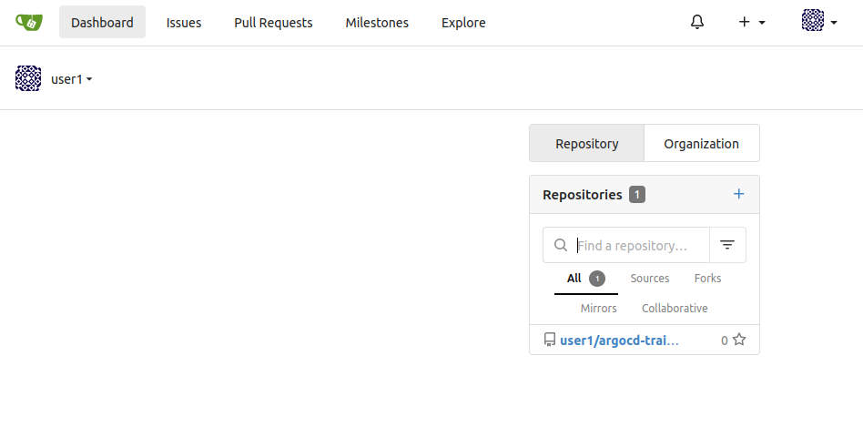

In this lab you will learn how to deploy a simple application using Argo CD.

Our lab setup consists of the following components:

* Git Server ([Gitea](https://gitea.io)): [https://{}](https://{}/)
* Argo CD Server: [https://{}](https://{})
* Kubernetes Cluster


{}


## Task {}.1: Login to the Gitea and Clone the Repo

For this Training we've installed a Git Server under [https://{}](https://{}/). We also forked the Argo CD Example Repo for your `<username>`.

Open your Webbrowser and navigate to [https://{}](https://{}/).
Login with the training credentials provided by the trainer (Login Button is in the upper right corner).

{}Users which have a personal Github account can just fork the Repository [argocd-training-examples](https://github.com/acend/argocd-training-examples) to their personal account. To fork the repository click on the top right of the Github on _Fork_.{}

{}


{}


## Task {}.1: Fork the Git repository

As we are proceeding according to the GitOps principle we need some example resource manifests in a Git repository which we can edit.

Users which have a personal Github account can just fork the Repository [argocd-training-examples](https://github.com/acend/argocd-training-examples) to their personal account. To fork the repository click on the top right of the Github on _Fork_.

All other users can use the provided Gitea installation of the personal lab environment. Visit [https://{}](https://{}/) with your browser and register a new account with your personal username and a password that you can remember ;)

{}All the cli commands in this chapter must be executed in the terminal of the provided Web IDE.{}


Login with the new user and fork the existing Git repository from Github:

1. Select _Create_ on the top right -> _New Migration_ -> Select _GitHub_
1. Migrate / Clone From URL: https://github.com/acend/argocd-training-examples.git
1. Click _Migrate Repository_

{}

The Git Repository is available under your Repositories



By clicking on the repository link in the repository list you get to the detail page.


The **URL** of the Git repository, we'll be working with, will look like `https://{}/<username>/argocd-training-examples.git`.

Within the Web IDE we set the `USER` environment variable to your personal `<username>`.

Verify that with the following command:
```bash
echo $USER
```

The `USER` variable will be used as part of the commands to make the lab experience more comfortable for you.

{}If you're **not** using our lab webshell to execute the labs, make sure to set the `USER` environment variable accordingly with the following command `export USER=<username>`{}


Clone the forked repository to your local workspace:

```bash
git clone https://$USER@{}/$USER/argocd-training-examples.git
```

... or the corresponding URL if you have choosen to use your own Git Server.

Change the working directory to the cloned git repository:

```bash
cd argocd-training-examples/example-app
```

When using the Web IDE: Configure the Git Client and verify the output

```bash
git config user.name "$USER"
git config user.email "$USER@{}"
```

And we also want git to store our Password for the whole day so that we don't need to login every single time we push something.

```bash
git config credential.helper 'cache --timeout=86400'
```

Then use the following command to verify whether the git config for username and email were correctly added:

```bash
git config --local --list
```


## Task {}.2: Deploying the resources with Argo CD

Now we want to deploy the resource manifests contained in the cloned repository with Argo CD to demonstrate the basic features of Argo CD.

To deploy the resources using the Argo CD CLI use the following command:

```bash
argocd app create argo-$USER --repo https://{}/$USER/argocd-training-examples.git --path 'example-app' --dest-server https://kubernetes.default.svc --dest-namespace $USER
```

Expected output: `application 'argo-<username>' created`

{}We don't need to provide Git credentials because the repository is readable for non-authenticated users as well{}

{}If you want to deploy it in a different namespace, make sure the namespaces exists before synching the app{}

Once the application is created, you can view its status:

```bash
argocd app get argo-$USER
```

```
Project:            default
Server:             https://kubernetes.default.svc
Namespace:          <username>
URL:                https://{}/applications/argo-<username>
Repo:               https://{}/<username>/argocd-training-examples.git
Target:
Path:               example-app
SyncWindow:         Sync Allowed
Sync Policy:        <none>
Sync Status:        OutOfSync from  (5a6f365)
Health Status:      Missing

GROUP  KIND        NAMESPACE    NAME           STATUS     HEALTH   HOOK  MESSAGE
       Service     <username>  simple-example  OutOfSync  Missing
apps   Deployment  <username>  simple-example  OutOfSync  Missing
```


The application status is initially in OutOfSync state. To sync (deploy) the resource manifests, run:

```bash
argocd app sync argo-$USER
```

This command retrieves the manifests from the git repository and performs a `{} apply` on them. Because all our manifests has been deployed manually before, no new rollout of them will be triggered on Kubernetes. But form now on, all resources are managed by Argo CD. Congrats, the first step in direction GitOps! :)

You should see an output similar to the following lines:

```
TIMESTAMP                  GROUP        KIND   NAMESPACE  NAME            STATUS    HEALTH        HOOK  MESSAGE
2021-03-24T14:19:16+01:00            Service  <username>  simple-example  OutOfSync  Missing
2021-03-24T14:19:16+01:00   apps  Deployment  <username>  simple-example  OutOfSync  Missing
2021-03-24T14:19:16+01:00            Service  <username>  simple-example    Synced  Healthy

Name:               argo-<username>
Project:            default
Server:             https://kubernetes.default.svc
Namespace:          <username>
URL:                https://{}/applications/argo-<username>
Repo:               https://{}/<username>/argocd-training-examples.git
Target:
Path:               example-app
SyncWindow:         Sync Allowed
Sync Policy:        <none>
Sync Status:        Synced to  (5a6f365)
Health Status:      Progressing

Operation:          Sync
Sync Revision:      5a6f365d8a65d1dab0761fc0d32b90f7eb480354
Phase:              Succeeded
Start:              2021-03-24 14:19:16 +0100 CET
Finished:           2021-03-24 14:19:16 +0100 CET
Duration:           0s
Message:            successfully synced (all tasks run)

GROUP  KIND        NAMESPACE    NAME           STATUS  HEALTH       HOOK  MESSAGE
       Service     <username>  simple-example  Synced  Healthy            service/simple-example created
apps   Deployment  <username>  simple-example  Synced  Progressing        deployment.apps/simple-example created
```

Check the [Argo CD UI](https://{}) to browse the application and their components. The URL of the Argo CD webinterface will be provided by the teacher.

Application overview in unsynced and synced state


Detailed view of a application in unsynced and synced state


## Task {}.3: Automated Sync Policy and Diff

When there is a new commit in your Git repository, the Argo CD application becomes OutOfSync. Let's assume we want to scale up our `Deployment` of the example application from 1 to 2 replicas. We will change this in the Deployment manifest.

Increase the number of replicas in your file `<workspace>/example-app/deployment.yaml` to 2.

```

apiVersion: apps/v1
kind: Deployment
metadata:
  name: simple-example
spec:
  replicas: 2
  revisionHistoryLimit: 3
  selector:
    matchLabels:
      app: simple-example
  template:
    metadata:
      labels:
        app: simple-example
    spec:
      containers:
      - image: quay.io/acend/example-web-go
        name: simple-example
        ports:
        - containerPort: 5000

```


Commit the changes and push them to your personal remote Git repository. After the Git push command a **password** input field will appear at the top of the Web IDE.

```bash
git add .
git commit -m "Increased replicas to 2"
git push
```

After a successful push you should see the following output

```bash
Enumerating objects: 7, done.
Counting objects: 100% (7/7), done.
Delta compression using up to 8 threads
Compressing objects: 100% (4/4), done.
Writing objects: 100% (4/4), 367 bytes | 367.00 KiB/s, done.
Total 4 (delta 3), reused 0 (delta 0), pack-reused 0
remote: Resolving deltas: 100% (3/3), completed with 3 local objects.
To https://{}/<username>/argocd-training-examples.git
   5a6f365..e2d4bbf  master -> master
```

Check the state of the resources by cli:

```bash
argocd app get argo-$USER --refresh
```

The parameter `--refresh` triggers an update against the Git repository. Out of the box Git will be polled by Argo CD in a predefined interval (defaults to 3 minutes). To use a synchronous workflow you can use webhooks in Git. These will trigger a synchronization in Argo CD on every push to the repository.

You will see that the Deployment is now OutOfSync:

```
Name:               argo-<username>
Project:            default
Server:             https://kubernetes.default.svc
Namespace:          <username>
URL:                https://{}/applications/argo-<username>
Repo:               https://{}/<username>/argocd-training-examples.git
Target:
Path:               example-app
SyncWindow:         Sync Allowed
Sync Policy:        <none>
Sync Status:        OutOfSync from  (e2d4bbf)
Health Status:      Healthy

GROUP  KIND        NAMESPACE    NAME            STATUS     HEALTH   HOOK  MESSAGE
       Service     <username>   simple-example  Synced     Healthy        service/simple-example created
apps   Deployment  <username>   simple-example  OutOfSync  Healthy        deployment.apps/simple-example created
```

When an application is OutOfSync then your deployed 'live state' is no longer the same as the 'target state' which is represented by the resource manifests in the Git repository. You can inspect the differences between live and target state by cli:

```bash
argocd app diff argo-$USER
```

which should give you an output similar to:

```
===== apps/Deployment <username>/simple-example ======
101c102
<   replicas: 1
---
>   replicas: 2
```

Now open the web console of Argo CD and go to your application. The deployment `simple-example` is marked as 'OutOfSync':


With a click on Deployment > Diff you will see the differences:


Now click `Sync` on the top left and let the magic happens ;) The application will be scaled up to 2 replicas and the resources are in Sync again.

Double-check the status by cli

```bash
argocd app get argo-$USER
```

```
Name:               argo-<username>
Project:            default
Server:             https://kubernetes.default.svc
Namespace:          <username>
URL:                https://{}/applications/argo-<username>
Repo:               https://{}/<username>/argocd-training-examples.git
Target:
Path:               example-app
SyncWindow:         Sync Allowed
Sync Policy:        <none>
Sync Status:        Synced to  (e2d4bbf)
Health Status:      Healthy

GROUP  KIND        NAMESPACE    NAME            STATUS  HEALTH   HOOK  MESSAGE
       Service     <username>   simple-example  Synced  Healthy        service/simple-example unchanged
apps   Deployment  <username>   simple-example  Synced  Healthy        deployment.apps/simple-example configured
```

Argo CD can automatically sync an application when it detects differences between the desired manifests in Git, and the live state in the cluster. A benefit of automatic sync is that CI/CD pipelines no longer need direct access to the Argo CD API server to perform the deployment. Instead, the pipeline makes a commit and push to the Git repository with the changes to the manifests in the tracking Git repo.

To configure automatic sync run (or use the UI):

```bash
argocd app set argo-$USER --sync-policy automated
```

From now on Argo CD will automatically apply all resources to Kubernetes every time you commit to the Git repository.

Decrease the replicas count to 1 and push the updated manifest to remote. Wait for a few moments and see check that ArgoCD will scale the deployment of the example app down to 1 replica. The default polling interval is 3 minutes. If you don't want to wait you can force a refresh by clicking `Refresh` in the UI or by cli:

```bash
argocd app get argo-$USER --refresh
```


## Task {}.4: Automatic Self-Healing

By default, changes made to the live cluster will not trigger automatic sync. To enable automatic sync when the live cluster's state deviates from the state defined in Git, run:

```bash
argocd app set argo-$USER --self-heal
```

Watch the deployment `simple-example` in a separate terminal

```bash
{} get deployment simple-example --watch --namespace=$USER
```

Let's scale our `simple-example` Deployment and observe whats happening:

```bash
{} scale deployment simple-example --replicas=3 --namespace=$USER
```

Argo CD will immediately scale back the `simple-example` Deployment to `1` replicas. You will see the desired replicas count in the watched Deployment.

```
NAME             READY   UP-TO-DATE   AVAILABLE   AGE
simple-example   1/1     2            2           114m
simple-example   1/3     2            2           114m
simple-example   1/3     2            2           114m
simple-example   1/3     2            2           114m
simple-example   1/3     3            2           114m
simple-example   1/1     3            2           114m
simple-example   1/1     3            2           114m
simple-example   1/1     3            2           114m
simple-example   1/1     2            2           114m
```

This is a great way to enforce a strict GitOps principle. Changes which are manually made on deployed resource manifests are reverted immediately back to the desired state by the ArgoCD controller.


## Task {}.5: Expose Application

This is an optional task.

{}
To expose an application we need to specify a so called `ingress` resource. Create an `ingress.yaml` file next to the `deployment.yaml` in the example-app directory with the following content.

```yaml
---
apiVersion: networking.k8s.io/v1
kind: Ingress
metadata:
  name: simple-example
spec:
  rules:
    - host: simple-example-<username>.{}
      http:
        paths:
          - path: /
            pathType: Prefix
            backend:
              service: 
                name: simple-example
                port: 
                  number: 5000
  tls:
  - hosts:
    - simple-example-<username>.{}
```

{}
{}
To expose an application we need to specify a so called `route` resource. Create an `route.yaml` file next to the `deployment.yaml` in the example-app directory.

```yaml
---
apiVersion: route.openshift.io/v1
kind: Route
metadata:
  name: simple-example
spec:
  port:
    targetPort: 5000
  to:
    kind: Service
    name: simple-example
    weight: 100
  wildcardPolicy: None
```
{}


Commit and Push the changes again, like you did before:


```bash
git add .
git commit -m "Expose application"
git push
```

After ArgoCD syncs the changes, you can access the example applications url: `https://simple-example-<username>.{}`

Verify using the following command:

```bash
curl https://simple-example-$USER.{}
```

The result should look similar to this:

```bash
<h1 style=color:#e81198>Hello golang</h1><h2>ID: e81198</h2>
```


## Task {}.6: Pruning

You probably asked yourself how can I delete deployed resources on the container platform? Argo CD can be configured to delete resources that no longer exist in the Git repository.

First delete the files `service.yaml` and `ingress.yaml` from Git repository and push the changes

```bash
git add .
git add --all && git commit -m 'Removes service and ingress' && git push

```

Check the status of the application with

```bash
argocd app get argo-$USER --refresh
```

You will see that even with auto-sync and self-healing enabled the status is still OutOfSync

```
GROUP              KIND        NAMESPACE  NAME            STATUS     HEALTH   HOOK  MESSAGE
networking.k8s.io  Ingress     <username> simple-example  OutOfSync  Healthy        ingress.networking.k8s.io/simple-example created
                   Service     <username> simple-example  OutOfSync  Healthy        
apps               Deployment  <username> simple-example  Synced     Healthy
```

Now enable the auto pruning explicitly:

```bash
argocd app set argo-$USER --auto-prune
```

Recheck the status again

```bash
argocd app get argo-$USER --refresh
```

```
GROUP       KIND        NAMESPACE  NAME            STATUS     HEALTH   HOOK  MESSAGE
extensions  Ingress     <username> simple-example  Succeeded  Pruned         pruned
            Service     <username> simple-example  Succeeded  Pruned         pruned
apps        Deployment  <username> simple-example  Synced     Healthy        deployment.apps/simple-example unchanged
```

The Service was successfully deleted by Argo CD because the manifest was removed from git. See the HEALTH and MESSAGE of the previous console output.


## Task {}.7: State of ArgoCD

Argo CD is largely built stateless. The configuration is persisted as native Kubernetes objects. And those are stored in Kubernetes _etcd_. There is no additional storage layer needed to run ArgoCD. The Redis storage under the hood acts just as a throw-away cache and can be evicted anytime without any data loss.

The configuration changes made on ArgoCD objects through the UI or by cli tool `argocd` are reflected in updates of the ArgoCD Kubernetes objects `Application` and `AppProject` in the `{}` namespace.

Let's list all Kubernetes objects of type `Application` (short form: `app`)

```bash
{} get applications --namespace={}
```

```
NAME               SYNC STATUS   HEALTH STATUS
argo-<username>    Synced        Healthy
```

You will see the application which we created some chapters ago by cli command `argocd app create...`. To see the complete configuration of the `Application` as _yaml_ use:

```bash
{} get applications argo-$USER -oyaml --namespace={}
```

You even can edit the `Application` resource by using:

```bash
{} edit applications argo-$USER --namespace={}
```

This allows us to manage the ArgoCD application definitions in a declarative way as well. It is a common pattern to have one ArgoCD application which references n child Applications which allows us a fast bootstrapping of a whole environment or a new cluster. This pattern is well known as the [App of apps]() pattern.


## Task {}.8: Accessing a private Git repository

The Git repository we have imported to Gitea is public available for the whole world. When accessing a private repository we have to provide credentials in form of a username/password pair or a ssh private key. In this task you will learn how to access a protected repo from Argo CD.

First make the Git repository in Gitea private by checking the option `Visibility: Make Repository Private` under `Settings -> Repository`. Now sync the app again.

```bash
argocd app sync argo-$USER
```

You will see the following error
```
FATA[0000] rpc error: code = FailedPrecondition desc = authentication required
```
Argo CD can't any longer access the protected repository without providing credentials for authentication. Next assign credentials to used Git repository. You have to provide the Gitea password interactively.

```bash
argocd repo add https://{}/$USER/argocd-training-examples.git --username $USER
```

{}
You can provide the password through the cli by using the flag `--password`.
{}

Now the sync should work. Argo CD use the configured credentials to authenticate against your repository in Gitea.

```bash
argocd app sync argo-$USER
```

You can define [credential templates](https://argoproj.github.io/argo-cd/user-guide/private-repositories/#credential-templates) when using the same credential for multiple Git repositories. The configured credentials are used for each Git repository beginning with the configured URL. The following command will create a credential which matches all git repositories for your username (e.g. https://\<username>@{}/\<username>)
```bash
argocd repocreds add https://{}/$USER --username $USER
```

Finally make your personal Git repository public again for the following labs. Uncheck the option `Visibility: Make Repository Private` under `Settings -> Repository` in the Gitea UI.

{}
TLS certificates and SSH private keys are supported alternative authentication methods by Argo CD. Proxy support can be configured as well in the repository settings.
{}

Have a look in the [documentation](https://argoproj.github.io/argo-cd/user-guide/private-repositories/) for detailed information about accessing private repositories.


## Task {}.9: Delete the Application

You can cascading delete the ArgoCD Application with the following command:

```bash
argocd app delete argo-$USER
```

Hit `y` to confirm the deletion and this will delete the `Application` manifests of ArgoCD and all created resources by this application. In our case the `Application`, `Deployment` and `Service` will be deleted.  With the flag `--cascade=false` only the ArgoCD `Application` will be deleted and the created resources `Deployment` and `Service` remain untouched.
