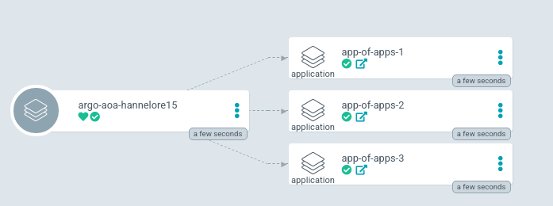

The App Of Apps pattern is a declarative specification of one ArgoCD app that consists only of other apps.
This way we have the possibility to deploy multiple apps within just one single App definition.

First let us examine our ArgoCD example repository with the child applications.

```
.
├── app-of-apps
│   ├── app1
│   │   └── deployment.yaml
│   ├── app2
│   │   └── deployment.yaml
│   ├── app3
│   │   └── deployment.yaml
│   └── apps
│       ├── app1.yaml
│       ├── app2.yaml
│       └── app3.yaml
```

As we can see the diroctory consists of three ArgoCD applications. Each of them has its own source path pointing on the corresponding directory (app1.yaml -> app1/). Each app directory contains a single kubernetes deployment file.


## Task {}.1: Specify the Application Resources

To deploy the app of apps into our namespace we need to edit the three application custom Resources (`app-of-apps/apps/*`):

* Replace all occurrences `<username>` in the three yaml files.
* Set the correct `<repourl>` eg. (`https://{}/userxy/argocd-training-examples.git`)

<!-- markdownlint-disable -->

apiVersion: argoproj.io/v1alpha1
kind: Application
metadata:
  name: <username>-app-of-apps-1
  namespace: argocd
  finalizers:
  - resources-finalizer.argocd.argoproj.io
spec:
  destination:
    namespace: <username>
    name: in-cluster
  project: default
  source:
    path: app-of-apps/app1
    repoURL: <repourl>
    targetRevision: HEAD

<!-- markdownlint-restore -->

Make sure to also commit and push your changes to the git repository.

{}
```bash
git add .
git commit -m "Update URLs for App of App"
git push
```
{}


## Task {}.2: Create Argo CD Application

Now let us create the parent Application which deploys our child applications as Custom Resources.

```bash
argocd app create argo-aoa-$LAB_USER --repo https://{}/$LAB_USER/argocd-training-examples.git --path 'app-of-apps/apps' --dest-server https://kubernetes.default.svc --dest-namespace $LAB_USER
```

Expected output: `application 'argo-aoa-<username>' created`

Explore the Argo parent application in the web UI.

As you can see our newly created parent app consits of another three apps.



